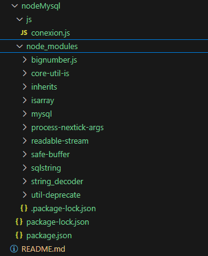

# Mysql

1. Iniciar node `npm init -y`
```bash
    \Mysql\nodeMysql\package.
    json:

    {
    "name": "nodemysql",
    "version": "1.0.0",
    "main": "index.js",
    "scripts": {
        "test": "echo \"Error: no test sp
    ecified\" && exit 1"
    },
    "keywords": [],
    "author": "",
    "license": "ISC",
    "description": ""
    }

```
2. Dependencia  `$ npm install mysql2`
   ```bash

        $ npm install mysql

        added 11 packages, and audited 12 packages in 3s

        found 0 vulnerabilities

   ```
   

3. ejecutar `node ConexionNode/js/conexion.js`